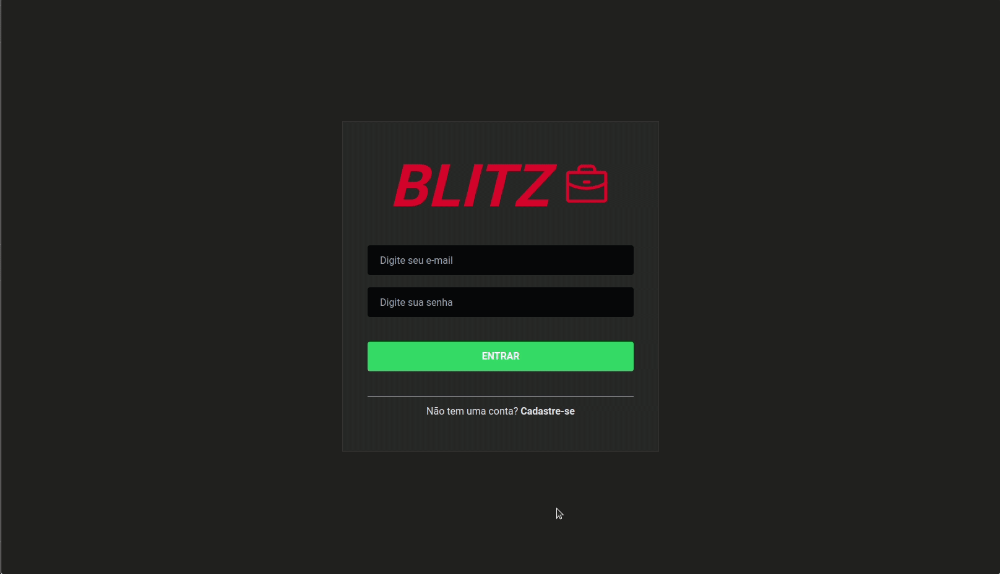

# ToDoList/Blitz

Repositório criado para armazenar a parte de frontend do App ToDoList/Blitz.

## Prévia

<p align="center">
  
</p>

## Descrição

Essa aplicação foi criada para que o usuário consiga salvar suas tarefas diárias com o status de pendente, em andamento ou pronto.

## Tecnologias

* JavaScript
* React
* React Router
* Context
* TailWind

## Instruções de instalação e configuração

Clone este repositório. Você vai precisar ```node``` e ```npm``` instalado globalmente em sua máquina

Instalação:

```npm install```

Para executar os testes:

```npm test```

Para iniciar o servidor:

```npm run dev```

A aplicação será iniciada em ```http://localhost:3000```

## Deploy

[Link Aplicação](https://desafioblitz-front.herokuapp.com/)
